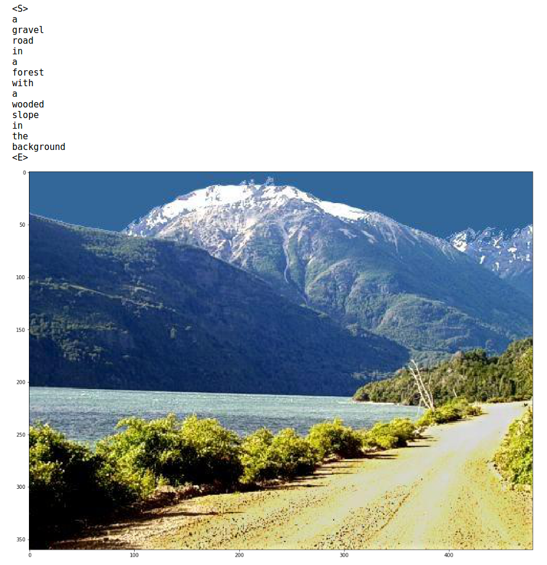

# Neural Image Captioning (NIC)
Neural image captioning implementation with Keras based on [Show and Tell](https://arxiv.org/abs/1411.4555).

# Instructions
To train from zero using the iapr2012 dataset:
* Download IAPR2012 dataset from [here](http://imageclef.org/photodata)
* Move the downloaded file to the datasets/IAPR_2012/ directory
* Untar the file:
> tar xvf iaprtc12.tgz

## Extract/download image features
### To extract:
* Edit the file train.py by changing the flag extract_image_features to True.

### To download:
* Download the image features:
* Download the extracted image features from [here](https://drive.google.com/open?id=0B-6ZrOvYmbrTd0Q5NEQ4cTB0Z0k)
* Move them do  datasets/IAPR_2012/preprocessed_data/ directory

* Start training by running the script 
> python3 train.py

# Notes
* Extracting the image features might take 1-2 hours in a GTX860M.
* Training 50 epochs should give you reasonable results.
* I will provide pre-trained models in COCO soon (hopefully)

